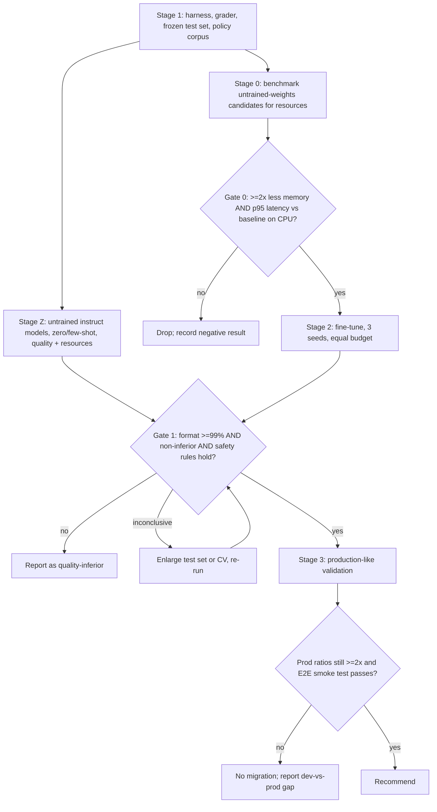

# Paper plan — comparing fine-tuned and untrained candidates for HR-query triage

**Status:** plan only — nothing here has been implemented or run. Thresholds in "Pre-registered
decision rules" (§7) must be committed *before* any Stage 2 result exists, so the commit history
proves they weren't tuned to the outcome.

**What changed from the previous version.** The original plan targeted the Wellington hazard-report
Triage Classifier; it is preserved unchanged as `docs/paper_plan_triage.md`. This version:

- swaps the task for a **stand-in HR-query task** (§1) so the method can be developed and
  rehearsed on a clean, fully synthetic problem;
- moves the baseline from Phi-3.5-mini to **Phi-4-mini-instruct**, and **newly fine-tunes** it
  (there is no deployed model for this task);
- puts the **policy text in the model input for every model** (option 1, §1.3);
- adds an **untrained / zero- and few-shot arm** (§5, Stage Z; confirmed, D9);
- re-derives the grader, test set, safety rule and gates for a two-label task (§3, §7);
- **(review revision)** replaces `next_step` with a model-emitted **`resolution`** plus a
  code-derived route (D8), makes **QWK the urgency endpoint** with a margin taken from annotator
  agreement (D3′), requires **two annotators on every test row** (D10), and declares **one primary
  endpoint family** with urgency and `resolution` as pre-registered secondary endpoints (D11).

The method (single benchmark script, process-isolated memory/latency, strict mechanical grader,
paired non-inferiority test, 2× resource gate, structured setup-effort rating) carries over.

**Research question.** For a routing-and-reply task (HR query + relevant policy text in →
`classification`, `urgency`, `resolution`, `summary` out; destination queue derived in code), can a smaller model — fine-tuned
BERT/BART family, a smaller decoder, or an *untrained* instruct model with a prompt — match a
fine-tuned Phi-4-mini-instruct (Q4_K_M) on quality while using substantially less memory and
latency on a CPU-only production-class target?



---

## 1. The task and its output contract

### 1.1 Task (stand-in, fully synthetic)

A general HR-department query (free text from an employee) is categorised on two parameters and
answered with a recommended reply and routing:

- **`classification`** ∈ {`leave_policy`, `complaint`, `hazard_report`, `hiring_request`,
  `other_unclear`}
- **`urgency`** ∈ {`low`, `medium`, `high`}
- **`resolution`** ∈ {`answer_from_policy`, `escalate_to_human`, `ask_clarification`} (D8) —
  model output carrying information *independent* of the class: whether the supplied policy
  covers the question and whether a human must act.
- **`summary`**: a one-to-two-sentence recommended response / case summary.
- **Destination queue (`route`) is not a model output.** It is derived in code from
  `classification` via a committed table (`eval/routing_table.yaml`; queue names provisional:
  `leave_policy`→hr_services, `complaint`→employee_relations, `hazard_report`→health_safety,
  `hiring_request`→recruitment, `other_unclear`→hr_triage) — the same "deterministic vs
  model-inferred" split the Wellington system applies to `hazard_type`. The user-facing "next
  step" is the pair (`resolution`, `route`).

This is a *stand-in*: it exists to exercise the methodology on a task whose data can be authored
freely. It is not part of the Wellington emergency-triage system. All data is synthetic: no real
people, cases, names or organisations. This repo stays free of personal information (`CLAUDE.md`).

### 1.2 Rules that make the labels gradable

- **One label per query.** Queries with several intents get a written **precedence rule**
  (proposed: `hazard_report` > `complaint` > `hiring_request` > `leave_policy`). Without it the
  test labels measure annotator disagreement, not the models.
- **`other_unclear` exists** so out-of-scope or ambiguous queries have a correct answer
  (`resolution = ask_clarification`). Include these in train and test (≈ 10%).
- **Urgency calibration rule** (written, committed before labelling), e.g. `high` = risk of
  physical harm, allegations of harassment/discrimination, or a deadline within 48 h; `medium` =
  time-bound but no harm; `low` = informational. Urgency is ordinal and subjective → the
  **endpoint is quadratic-weighted κ (QWK)**, with exact match and within-one reported as
  secondary measures, and model QWK always shown next to the **human–human QWK ceiling** (D3′).
- **`resolution` gold rule** (written, committed before labelling): `answer_from_policy` = the
  supplied clause covers the question and no human decision is needed; `escalate_to_human` = a
  human must act (complaints, hazards, approvals) or the clause does not cover the question;
  `ask_clarification` = the query is ambiguous or missing information. `resolution` still
  correlates with class, which is why a class→resolution control exists (§3.5).
- **Urgency correlates with class** (hazards mostly high, leave mostly low). That is realistic,
  and it makes "class-only → urgency" a useful trivial control (§3).

### 1.3 Policy text is in the input for every model (decision D7)

Fine-tuning on policy Q&A alone would put facts in the weights: they are unreliable on
paraphrased or novel questions, go stale when policy changes, and cannot be checked by a
mechanical grader. Instead:

- A small **synthetic policy corpus** (≈ 30–60 short clauses: leave entitlements, complaint
  procedure, hazard-reporting procedure, hiring-request process) is committed with stable clause
  IDs.
- Each example's input = the query **plus the relevant clause(s)** (gold clause + 1–2 distractors,
  fixed per example). Retrieval is *given*, not tested: the benchmark measures grounding and
  routing, not search. State this limitation.
- **The same canonical render function** builds this input for training data, the benchmark, and
  any serving code (`build_user_message(query, clauses)`); a test asserts the stored test text
  equals the render output. Training data is built with policy present, so fine-tuned models
  learn to *use* the text, not memorise it.
- **Frontier/untrained models get the identical rendered input** — no extra hints — so quality
  gaps reflect the models, not different inputs.
- **Held-out clauses.** A slice of the test set uses clauses never seen in training (new
  entitlement numbers / procedures), to show the models read the snippet rather than recall
  training facts.
- **Abstention cases.** Some examples carry no clause that answers the question; the correct
  behaviour is `resolution` ∈ {`escalate_to_human`, `ask_clarification`} (never `answer_from_policy`) and a summary that states no figure. This makes abstention directly gradable.

### 1.4 Output format and mechanical checks

Raw model output is exactly four lines, in order:

```
Classification: <leave_policy|complaint|hazard_report|hiring_request|other_unclear>
Urgency: <low|medium|high>
Resolution: <answer_from_policy|escalate_to_human|ask_clarification>
Summary: <1-2 sentences>
```

The strict grader (`eval/grader.py`; rejects, never defaults) checks:

1. **Format**: exactly four lines, label spelling, enum membership, lowercase, summary non-empty
   and ≤ N tokens / ≤ 2 sentences, no trailing text, EOS reached before `max_new_tokens`
   (truncation = fail).
2. **Semantic**: `classification`, `urgency` and `resolution` equal gold; urgency also scored ordinally (QWK, within-one).
3. **Route derivation**: the code-derived `route` for the predicted class is computed through
   the same `routing_table.yaml` used for gold labels; a test asserts a gold row's route equals
   the table's output. A critical misroute (§7) is a *class* error visible through this table.
4. **Grounding (mechanical)**: every number/duration/date token in `summary` also appears in the
   supplied clause text; on abstention examples the summary contains none. A wrong figure is a
   hard fail — this is the hallucination check the format grader alone cannot do.
5. **Safety-weighted**: confusion matrices; the specific costly errors in §7.

Summary *prose quality* is not mechanically gradable. It is **not** in the pass rate and never a
gate. Report mechanical properties only (length, sentence count, non-empty, grounding), plus an
optional, clearly secondary reference-based similarity (e.g. BERTScore).

**Pass rate (primary generative metric)** = format valid ∧ classification correct ∧ urgency correct
∧ resolution correct ∧ grounding clean. **Descriptive only** — not an endpoint (D11). **Per-field
metrics** are always reported, since the joint metric is harsh when urgency labels are noisy.

**Non-generative candidates (D1, generalised).** BERT/DistilBERT use classification heads and
cannot write a summary. They are scored on the **labels-only contract**
(`classification`, `urgency`, `resolution`; three heads) and `contract: labels_only` is
recorded in every row; only generative candidates are scored on the full contract. `summary` is
`null` for labels-only candidates (default; to settle in implementation).

---

## 2. The single benchmark script

`backend/eval/benchmark_model.py` — one entry point, identical for every candidate and the
baseline:

```bash
python -m eval.benchmark_model \
  --task hr_query --model <path-or-hf-id> \
  --backend {llamacpp,mlx,hf,onnx,ctranslate2} \
  --mode {finetuned,zeroshot,fewshot} --k-shots 0 \
  --split {test,valid} --n-runs 100 --threads 4 --device cpu \
  --out results/<run_id>.json --preds-out results/<run_id>.preds.jsonl
```

- **Task registry**: `--task hr_query` binds prompt builder, gold labels, strict grader and
  contract. Prompt assembly imports the canonical render — never re-typed.
- **Backend adapters** (`load()`, `generate(prompt) -> text, n_out_tokens`). Backend is a recorded
  variable, not hidden.
- **Process isolation**: a fresh child process per model per phase; the parent samples child RSS
  with `psutil` (10 ms); in-process `ru_maxrss` is avoided. Phases: load → first request →
  5 discarded warm-ups → N timed requests. On Apple Silicon also record MLX/Metal peak memory
  (RSS under-counts unified memory; verify the API name for the installed `mlx`).
- **Determinism**: greedy decoding, fixed seed, fixed `--threads`, `max_new_tokens` set from the
  longest gold output plus margin (replaces triage's 80; this task's output is longer).
  `--serving-sampling` reruns at the intended serving temperature as a sensitivity check.
  Stage 1 verifies two runs on the same weights give identical predictions, or reports the
  observed tolerance.
- **Primary device is CPU** (`n_gpu_layers=0` / `device=cpu`), because the assumed production
  target is CPU-only (4 vCPU / 16 GiB). Metal/MPS runs are dev-only secondary rows.
- **Prompt length is a recorded variable.** Few-shot prompts are much longer than fine-tuned
  prompts; mean prompt tokens, mean generated tokens and an estimated FLOPs/request
  (≈ 2 × params × tokens processed, labelled an estimate) go in every row.
- **Environment fingerprint** in every row: git SHA, dataset and policy-corpus SHA-256s, model
  file SHA-256, library versions, CPU model, OS, threads, seed.

Row schema (sketch):

```json
{
  "run_id": "...", "task": "hr_query", "model": "phi4mini-q4km-baseline", "backend": "llamacpp",
  "mode": "finetuned", "device": "cpu", "threads": 4, "seed": 0, "decoding": "greedy",
  "env": {"git_sha": "...", "dataset_sha256": "...", "policy_sha256": "...", "model_sha256": "...", "libs": {}, "cpu": "..."},
  "static": {"params_m": 0, "disk_mb": 0, "quant": "Q4_K_M", "mean_prompt_tokens": 0},
  "memory": {"peak_rss_load_mb": 0, "peak_rss_infer_mb": 0, "metal_peak_mb": null},
  "train": {"total_s": 0, "to_best_ckpt_s": 0, "s_per_step": 0, "samples_per_s": 0,
            "tuning_budget_total_s": 0, "peak_train_mem_mb": 0, "trainable_params_m": 0, "seeds": 3},
  "time": {"load_s": 0, "cold_first_s": 0, "n": 100,
           "avg_s": 0, "p50_s": 0, "p95_s": 0, "p99_s": 0, "tok_per_s": 0},
  "quality": {"n": 0, "format_pass": 0, "class_acc": 0, "urgency_acc": 0, "urgency_within1": 0,
              "resolution_acc": 0, "grounding_clean": 0, "pass_rate": 0,
              "class_macro_f1": 0, "urgency_qwk": 0, "urgency_qwk_human_ceiling": 0,
              "critical_misroute": 0, "under_urgency": 0,
              "by_class": {}, "slice_heldout_clause": {}, "ci95": {"pass_rate": [0, 0]}},
  "setup": {"finetune": {"scores": {}, "median": 0, "raters": 2, "steps": 0, "manual_interventions": 0,
                         "errors_hit": 0, "time_to_first_run_h": 0},
            "serving": {"apple_silicon": {}, "gcp_x86": {}}},
  "contract": "full | labels_only"
}
```

`backend/eval/compare_rows.py` consumes baseline + candidate rows and per-example predictions →
diff table, paired bootstrap CI, McNemar test, gate verdicts.

---

## 3. Candidates

### 3.1 Model set

| ID | Model | Params | Type | Contract | How it is used |
|---|---|---|---|---|---|
| **B0** | `microsoft/Phi-4-mini-instruct`, LoRA fine-tuned here, Q4_K_M GGUF | ~3.8B | dense decoder | full | **Newly fine-tuned baseline** (nothing deployed for this task) |
| **A** | `bart-base` | ~140M | encoder-decoder | full | fine-tuned |
| **C** | `distilbert-base-uncased` (multi-head classifier) | ~66M | encoder + heads | labels_only | fine-tuned |
| **C′** | `bert-base-uncased` | ~110M | encoder + heads | labels_only | capacity ablation of C only |
| **D** (optional) | `google/gemma-3-1b-it`; fallback `LFM2-1.2B` | ~1B | decoder | full | fine-tuned **and** untrained (Stage Z) |
| **R-big** | Phi-4 (14B) | ~14B | dense decoder | full | **Reference only** (see §3.2); never a deployment candidate |
| **R-frontier** | one frontier API model | n/a | n/a | full | Quality ceiling, policy in prompt (see §5); resources not comparable |

Stage-Z (untrained) rows are added for B0's family and D: Phi-4-mini-instruct zero- and few-shot,
and D's instruct model zero- and few-shot. BERT/BART have no useful untrained mode (random heads)
and enter Stage 0 only.

### 3.2 Which Phi-4 variant is the baseline

**Phi-4-mini-instruct**, not the 14B Phi-4. Verified from the model card and `config.json`
(WebFetch of huggingface.co, this session):

- exists as an instruct variant; MIT licence; ~3.8B parameters; 128K context; released
  February 2025;
- `architectures: Phi3ForCausalLM`, 32 layers, hidden 3072, **24 attention heads / 8 KV heads**
  (GQA), **vocab 200,064**, **tied embeddings**, LongRoPE, partial rotary factor 0.75.

Why not the 14B: at Q4_K_M it needs roughly 8–9 GB for weights alone and would be impractically
slow on 4 vCPU. A "≥ 2× cheaper" gate against it would be trivially met by almost anything and
therefore meaningless, and the production shape would have to change. It is kept as **R-big**: one
Stage-0 resource row (to show the scale argument) and, optionally, a quality reference on Apple
Silicon. It is not fine-tuned, not gated, not recommended. (If the production target changes to
GPU or a much larger CPU instance, revisit; recorded as D6.)

Tooling facts still **not** confirmed (search results this session were inconclusive):

- `mlx_lm.lora` training on Phi-4-mini-instruct: community GGUF builds exist for llama.cpp, and a
  third-party MLX LoRA adapter for `mlx-community/Phi-4-mini-instruct-4bit` exists, but neither
  proves *training* works in the installed `mlx_lm`. Stage 0 step 0 must run a 20-step
  `mlx_lm.lora` smoke test and a GGUF convert-and-load round trip before anything depends on it.
- Whether the existing fuse → GGUF → Cloud Run path used for Phi-3.5 works unchanged (200k vocab
  and tied embeddings change file size and conversion behaviour).

### 3.3 Candidate-D architecture rule, re-checked against the new baseline

D must differ from the baseline on at least one *structural* axis, and have both an `mlx_lm` LoRA
path and a llama.cpp/GGUF path, so the pipeline stays identical to the baseline's.

The new baseline is *closer* to the Llama-3.2 family than Phi-3.5 was: Phi-4-mini now has GQA, a
large (~200k) vocabulary and tied embeddings — exactly the axes on which the old plan said
Llama-3.2-1B differed. Consequently:

- **Llama-3.2-1B and Qwen-class ~1B models do not qualify.** They are the same dense decoder
  design; use only as a labelled **size-only control**, if at all.
- **Gemma-3-1B still qualifies** (interleaved local sliding-window / global attention is a
  structural difference; Phi-4-mini's `sliding_window` entry is effectively inactive at 262,144
  vs 128K context, so it is not a sliding-window model in practice — verify in Stage 0).
- **LFM2-1.2B-class still qualifies** (hybrid gated short-convolution + attention blocks).
- A Mamba/SSM ~1B model qualifies architecturally; GGUF/MLX support must be confirmed.

Unverified, to check in Stage 0 before D is included: Gemma-3 and LFM2 `config.json`, `mlx_lm`
LoRA support for each, llama.cpp/GGUF support for each, and licences (Gemma and LFM2 carry
custom licences — confirm before publishing any derived weights). If none passes, drop D rather
than substitute a same-architecture model under another name.

### 3.4 Tooling caveats for BERT/BART (unchanged, still to verify)

- `mlx_lm.lora` targets decoder LLMs → train A and C with HF Transformers (+ PEFT, or full
  fine-tuning; at this size full FT is feasible — run LoRA as primary if LoRA is required, full FT
  as an ablation).
- llama.cpp's BERT support targets embeddings, not classification heads; BART may be unsupported.
  If so, A and C serve via ONNX Runtime int8 (or CTranslate2 for BART). Runtime becomes a
  confound: report each model on its best supported runtime *and* any pair sharing a runtime;
  don't claim an architecture effect that is really a runtime effect.

### 3.5 Controls (cheap, strengthen the paper)

- Majority class; keyword rules per class; **TF-IDF + logistic regression** (three heads) on the
  rendered input; **class-only → urgency** and **class-only → resolution** rules (quantify how much of these fields is just the class). If a trivial classifier is within tolerance of
  B0 on the labels, that is a central finding.
- Quantisation ablation: B0 fused FP16/MLX vs Q4_K_M.
- A **"summary-copy" control**: output the first sentence of the gold clause as the summary — shows
  how much of the grounding check a trivial strategy passes.

---

## 4. Stage 1 — harness, grader, policy corpus and test set *(needed regardless)*

Everything in the previous plan's Stage 1 is re-derived for this task:

1. **Author the policy corpus** (§1.3) with clause IDs; commit its SHA-256.
2. **Author the training/validation data** as a CSV (`hr_query_examples.csv`): query, gold
   clause IDs, classification, urgency, resolution, reference summary, `row_id` (hash of
   normalised query text). CSV-driven, generated to JSONL by a script that uses the canonical
   render and round-trip validates each row. Pin the CSV by SHA-256.
3. **Stable, stratified split** (`hr_query_splits.json`): by `row_id`, stratified by
   `classification × urgency`; persisted, never reshuffled. Lesson carried from the triage audit:
   a regenerating split and a validation set reused for headline numbers are both invalid.
4. **Frozen test set** (`backend/data/hr_query_test/test.jsonl`):
   - Newly authored rows, not carved from the training CSV; stratified over 5 classes × 3
     urgencies; `high` urgency and `hazard_report` / `complaint` deliberately over-represented
     (the costly classes) — target ≥ 40 rows in each of those cells combined with ≥ 40 gold-`high`.
   - Includes the **held-out-clause slice** and the **abstention slice** (§1.3).
   - **Size**: target 300–400, **floor 150**. The earlier power estimate (≈ 360 rows for ±4
     points when ≈ 15% of items disagree between two models) was derived for triage; **re-estimate
     from the pilot disagreement rate on this task** before fixing the target. Size the set for the
     **primary endpoint family** (§7: classification accuracy and the two safety counts); the
     secondary endpoints are reported with whatever precision the set gives. Safety counts are
     small numbers → compared with exact paired tests, so the ≥ 40 rows per costly cell matter more
     than the total.
   - **Authoring (D2 carried over)**: machine-drafted, then human-verified/corrected. Drafts come
     from a generator that is **not** a candidate being evaluated *and not the R-frontier model*
     (see §5 circularity warning); committed prompt; per-row `generator`, `prompt_version`,
     date. **Every test row is independently labelled by two annotators (A1, A2; IDs only; D10)**
     on `classification`, `urgency` and `resolution`, each recording `human_action` ∈ {accepted,
     edited, rejected} against the draft. Disagreements are adjudicated in a logged step (who,
     what changed, why); the adjudicated label is gold. Rejected rows kept in an audit file.
     **Anchoring audit and ceiling**: a random, stratified ≥ ⅓ of rows is labelled **blind**
     (before seeing the draft) by *both* annotators. Human–human agreement on this blind subset —
     Cohen's κ for `classification` and `resolution`, QWK for `urgency`, each with bootstrap CI —
     is the **unanchored ceiling** models are compared against. Agreement on the non-blind rows
     is reported but flagged as inflated by anchoring. Also report blind-vs-draft agreement.
   - Frozen by SHA-256; never used for tuning or checkpoint selection; evaluated once per final
     configuration.
5. **Leakage tests (pytest, CI)**: no test query/full message in train/valid; max token-Jaccard
   test→train below threshold (start 0.6); split stable when unrelated rows are appended;
   held-out-clause slice really has no clause ID present in any train example.
6. **Strict grader + contract tests** (§1.4) with a table of good/bad outputs: extra lines, wrong
   case, unknown enum, missing summary, truncated, invented number, number present in the clause,
   abstention with a figure, `answer_from_policy` on an abstention row, route derivation for each class.
7. **Benchmark script + `compare_rows.py`** (§2) with the determinism test.
8. **Reproduce the baseline**: fine-tune B0 once (Phi-4-mini-instruct, smoke-tested per §3.2),
   run it on the test set → first row. If it fails format > 1% at greedy decoding, that changes the
   interpretation of every comparison.

*Exit criterion:* baseline row exists, reruns identically, tests green.

---

## 5. Stage 0 and Stage Z — resource screen and untrained models

### Stage 0 — resources only (untrained weights are a valid probe)

Memory and latency depend on architecture, size, quantisation and sequence length, not on trained
weights. Run the benchmark on B0, A, C, C′, D, R-big with identical settings (CPU, 4 threads,
N=100, real validation-split prompts, same `max_new_tokens`), 3 repeats of the whole process.
Generative candidates get ~20–50 LoRA steps first so they emit the four-line format and
realistic token counts.

**Gate 0 (pre-registered):** a candidate proceeds only if, on CPU, both `peak_rss_infer_mb` and
p95 latency are **≤ 50% of B0's**, with repeat spread smaller than the margin by which it clears.
Fail → drop, keep the row as a negative result. Expected: encoders clear it trivially, so Gate 0
mainly screens D and A and confirms magnitudes. Passing earns a fine-tune, nothing more.

### Stage Z — untrained open instruct models (decision D9: confirmed)

**Why it is worth doing.** It answers a question fine-tuning rows cannot: *is fine-tuning needed
at all?* If an untrained instruct model with a good prompt is non-inferior to the fine-tuned
baseline, the cost (data authoring, training, conversion, setup effort) vanishes. It also shows
what fine-tuning buys, and gives the paper an honest "no training" row.

**Design.**

- Models: Phi-4-mini-instruct and D's instruct model (and optionally one larger open instruct
  model as a reference, on Apple Silicon only). "Untrained" here means *no task fine-tuning*; it
  must be the **instruct** variant, since pretrained-only base models do not follow the four-line
  format and would fail on format, which says nothing about capability. A pretrained-only row may
  be added as an appendix to show that.
- Modes: **zero-shot** (system prompt with the contract and policy clause) and **few-shot**
  (k = 3 and k = 8 examples drawn from *train*, fixed, same for all models, selected before looking
  at test). Prompt wording is frozen before any test run; allow a bounded, equal number of prompt
  variants per model, selected on valid, never test.
- The strict grader is unchanged. Format failures are first-class results: untrained models are
  expected to fail format more often, and Gate 1's ≥ 99% format rule applies to them too.
- **Resource rows are not comparable to fine-tuned rows** without care: few-shot prompts are much
  longer, which raises latency and memory. Record mean prompt tokens, and report resources for
  untrained models separately and at their actual prompt length.
- **R-frontier (quality ceiling)** receives the identical rendered input (§1.3). It is reported as
  a reference, never gated or compared on resources. **Circularity warning:** if the same model
  drafted the test set (§4 item 4), it will be flattered; draft with one model/vendor and
  evaluate with another, or label the row as contaminated.
- Encoders (BERT/DistilBERT) have no untrained quality mode — skip.

Untrained rows enter Gate 1 against B0 like any fine-tuned candidate.

---

## 6. Stage 2 — fine-tune and compare

**Training protocol (identical across candidates)**

- Same canonical train/valid split; inputs from the same rendered user message (including policy
  clauses). A per-family conversion function (decoder: chat messages; BART: source = system+user
  text, target = the four-line output; encoder: message → heads) unit-tested against the
  canonical render. Encoders have a 512-token limit — measure the rendered length distribution
  first; truncation policy is decided once and stated (do not silently cut the policy clause).
- **Equal tuning budget**: same number of configurations (≤ 6) per candidate, same early-stopping
  rule, selected on **valid** (loss *and* strict metrics), never test.
- **3 training seeds** per candidate including B0; report mean ± sd.
- **Time to fine-tune is a measured outcome for every model**, via `eval/train_timer.py`:
  total wall-clock per run, time to the best validation checkpoint, per step/epoch and samples/s,
  whole-tuning-budget wall-clock, peak training memory, trainable parameters, steps used. All
  fine-tuning timed on the same idle, plugged-in Apple Silicon machine; thermal state noted.
  Caveat: training time depends on framework (MLX vs PyTorch-MPS/CPU), so it is a pipeline-level
  cost, not a pure architecture property.
- Class imbalance (e.g. `hazard_report`, `high`) handled once, applied to all, stated.
- **Reduce confounding (per family)**: find each family's *best* fine-tuning recipe (LoRA rank /
  target layers / lr / steps vs full FT; imbalance handling) and *best* serving architecture
  (GGUF quant levels, ONNX fp32 vs int8, CTranslate2, PyTorch reference), chosen on valid. Give
  the baseline the same tuning protocol so it is not the only untuned model. Report two
  comparisons: each family at its tuned best, and all families under one controlled setting.

**Evaluation protocol**

- Test set evaluated **once per final (seed × candidate)** after selection is frozen. If the
  protocol changes, old results stay in the appendix.
- **Endpoints are declared in advance (D11).** *Primary family*: strict format pass,
  classification accuracy (non-inferiority), the two safety counts, grounding, and the resource
  gate. *Secondary (pre-registered)*: urgency QWK (plus exact / within-one / MAE) and
  `resolution` accuracy. *Descriptive*: joint pass rate, macro-F1, per-class breakdown,
  held-out-clause and abstention slices, summary mechanical properties.
- Statistics: Wilson intervals; **paired** bootstrap CI (10k resamples) and exact McNemar vs B0;
  seed variance alongside; Holm correction across candidates **and across the secondary endpoints**. The primary family is an all-must-pass (intersection) rule, so it needs no alpha split between its members, but each member needs enough power — the sizing driver in §4 item 4.
- Optional 5-fold CV on train+valid only, to tighten variance if the test set ends near the floor.
- Robustness slice (small, mechanical): typo/paraphrase/long-query perturbations — degradation
  reported, not gated.

**Setup-effort evaluation (subjective, structured; never a gate)** — unchanged in method:

- Two ratings per model: *fine-tuning setup* and *serving setup* (per environment). For untrained
  models the fine-tuning rating is "n/a" and the effort is *prompt engineering* (rate that
  instead).
- Rubric `backend/eval/setup_rubric.md`, committed before the first candidate: 1–5 on
  documentation; tooling maturity; manual steps; debugging burden; dependency fragility;
  reproducibility; portability (Apple Silicon → GCP x86); serving operational complexity.
- Dated contemporaneous setup logs per model per phase; scores assigned from the log. Objective
  counters beside the scores (steps, manual interventions, distinct errors, time to first
  end-to-end run, extra dependencies, glue-code lines, deployable artifact count).
- ≥ 2 independent raters (IDs only), median/range/disagreement reported. Bias controls:
  one rater who didn't build the baseline follows its written recipe on a clean machine; fixed
  setup order; same time-box per candidate, with "not achieved" recorded as a result. Used only to
  rank candidates that are otherwise comparable.

---

## 7. Pre-registered decision rules (Gate 1)

All must hold for a candidate to be recommended. **Numbers are carried over from the triage plan
as a proposal (D3); the justification must be re-argued for this task and the values frozen in
`gates.yaml` before any Stage 2 run.**

**Primary family — all must hold to recommend (frozen in `gates.yaml`):**

| Criterion | Rule |
|---|---|
| Format validity (full-contract candidates) | strict format pass ≥ 99% on test at greedy decoding |
| Classification, non-inferiority | paired-bootstrap 95% CI lower bound of (candidate − B0) `classification` accuracy **> −5 points** |
| Grounding (full-contract only) | grounding-clean rate not lower than B0's by more than the margin, **and** invented figures on the abstention slice not above B0's count |
| Safety 1 — critical misroute | count of gold `hazard_report` or `complaint` predicted as `leave_policy` or `hiring_request` **not higher than B0's** (exact paired test; any increase → manual row review) |
| Safety 2 — under-urgency | count of gold `high` urgency predicted not-`high` **not higher than B0's** (same procedure) |
| Resource | still ≥ 2× on memory and p95 latency after fine-tuning (untrained models: at their real prompt length) |

**Secondary endpoints — pre-registered, reported with Holm-corrected CIs, do not gate on their own:**

| Endpoint | Non-inferiority reference |
|---|---|
| Urgency QWK | CI lower bound of (candidate − B0) QWK **> −δ_u**, where **δ_u = half-width of the 95% bootstrap CI of the human–human QWK on the blind pilot subset**, rounded down to 0.01, floored at 0.02 (D3′). Model QWK is always shown against the human–human ceiling; a model at or above the ceiling is *saturated*, and further differences are not interpretable |
| `resolution` accuracy | same −5-point rule as classification |

A candidate found **inferior** on a secondary endpoint is still recommendable on the primary
family, but the verdict must state the inferiority as a caveat — the recommendation text cannot
omit it. Within-one urgency and MAE are descriptive.

Any increase on a safety count triggers manual review of those rows regardless of aggregate score.
Three-way outcome: **non-inferior** (CI lower bound > −5), **inferior** (CI upper bound < 0 *and*
point estimate ≤ −5), otherwise **inconclusive** → enlarge test set / add CV and re-run; never call
inconclusive a win or loss.

Rationale to re-argue for this task (carry reasoning into the methods section):

- **5-point margin (classification, `resolution`)**: the largest loss accepted in exchange for the
  saving. For a routing aid whose output a human reviews it is tolerable; classification is the
  least subjective, most checkable label, which is why it carries the primary endpoint. Must stay
  no tighter than the test set's resolvable noise (re-derive from pilot data, §4 item 4).
- **Urgency margin from the data, not by fiat**: a margin smaller than the labels' own noise
  cannot be verified, and a larger one is arbitrary. Anchoring δ_u to the human–human CI
  half-width states exactly "we cannot distinguish differences smaller than what two humans
  disagree by". It is computed from the pilot blind subset and frozen before Stage 2.
- **Why urgency and `resolution` are secondary**: the primary family already contains an
  all-must-pass rule; adding noisy, correlated fields as gates would shrink power and encourage
  selecting margins after the fact. Declaring the hierarchy in advance, with caveats mandatory,
  keeps the paper honest without making the recommendation hostage to label noise.
- **2× resource gate**: unchanged reasoning — below ~2× is inside run-to-run and dev-vs-prod drift
  and would not change which instance size is viable; both memory and latency must pass.
- The safety rules replace the triage "under-triage" rule; they are stated as counts relative to
  B0 because average accuracy can hide a worse miss rate on the costly cells.

---

## 8. Stage 3 — production-representative validation

1. Run the benchmark inside a container on **x86-64 Linux CPU** (Cloud Build / small GCE VM /
   Cloud Run job — not an arm64 Mac under emulation) at 4 vCPU / 16 GiB, and at the smaller shape
   the candidate would permit (e.g. 2 vCPU / 4 GiB; the old Phi-3.5 pipeline hit OOM-kills at
   4 GiB, and Phi-4-mini's 200k vocabulary makes the embedding/output matrix larger — measure, don't
   assume).
2. Check ratios, not absolutes: do dev-machine candidate/B0 ratios hold (≥ 2×)? Report drift.
3. Real cold start (`min-instances=0`): container start → first handled request through an HTTP
   endpoint, baseline vs candidate; record memory utilisation and billable time.
4. End-to-end contract smoke test: a thin HTTP endpoint wrapping the model, driven by a seeded
   query set; assert the four fields parse, enums are valid, and the labels-only variant behaves
   (summary `null`). (No dashboard exists for this stand-in task, so this replaces the triage
   dashboard smoke test.)
5. Only then write the recommendation, or the "do not migrate" conclusion.

---

## 9. Paper structure and validity

Outline: (1) motivation — small models for routing-and-reply tasks; (2) task and output contract
(policy-in-prompt design); (3) dataset construction and held-out protocol; (4) candidates, controls
and the untrained arm; (5) benchmark methodology; (6) results — resource table, quality table,
Pareto plot (pass rate vs p95 vs peak RSS), safety analysis, untrained-vs-fine-tuned, dev-vs-prod;
(7) threats to validity; (8) reproducibility package.

Threats to validity:

- Fully synthetic, small, single-team-authored data, and a stand-in task: results show the method
  and in-distribution behaviour, not fitness for real HR use or any real policy.
- Policy retrieval is given, not tested; real systems also err in retrieval.
- Label subjectivity (urgency especially) — κ reported separately per field.
- Machine-drafted test labels and the R-frontier circularity (§5) if not separated.
- Setup-effort score is subjective and familiarity-dependent; supporting evidence only.
- Runtime/quantisation confounds across families (§3.4); few-shot prompt-length confound (§5).
- Test-set size limits resolvable effect sizes.
- Not legal or HR advice; the synthetic policy is invented and says nothing about real entitlements.

Reproducibility package: lockfiles, container digest, dataset and policy-corpus hashes, split file,
benchmark script, raw rows and per-example predictions, seeds, hardware fingerprint, model-card and
licence notes (Phi-4-mini: MIT, confirmed; Gemma / LFM2 custom licences: confirm). Repo hygiene per
`CLAUDE.md`: no participant names or contact details; no references to the internal validation
project; confirm base-model licences before releasing weights.

---

## 10. Decisions

| # | Decision | Status |
|---|---|---|
| D1 | Candidates that cannot generate text | **Decided (generalised):** labels-only contract for encoders; `summary = null` |
| D2 | Test-set authoring | **Decided:** machine-drafted, human-verified, blind-label anchoring audit; drafter ≠ any evaluated model (≠ R-frontier) |
| D3 | 5-point margin and 2× gate | **Carried over as proposal; re-argue for this task and freeze in `gates.yaml`** (see D3′) |
| D3′ | Urgency margin | **Decided (this revision):** QWK endpoint; δ_u from the human–human QWK CI on the blind pilot subset (§7); ceiling always shown. Numeric value frozen in `gates.yaml` after the pilot |
| D4 | Optional ~1B decoder must differ structurally from baseline | **Decided; re-checked** against Phi-4-mini (§3.3): Llama-3.2/Qwen ~1B no longer qualify |
| D5 | Environments | **Decided:** Apple Silicon (dev + fine-tuning timing), then GCP x86-64 CPU (Stage 3) |
| D6 | Baseline | **Decided:** Phi-4-mini-instruct, newly fine-tuned; Phi-4 14B reference-only. Revisit if the target moves off 4 vCPU CPU |
| D7 | Policy handling | **Decided:** policy text in the input for all models (option 1); retrieval given |
| D8 | `next_step` design | **Decided (this revision):** model emits `resolution` ∈ {answer_from_policy, escalate_to_human, ask_clarification}; destination queue derived in code from `classification` (§1.1). Avoids a redundant label that would double-count class errors |
| D9 | Untrained models | **Decided:** include Stage Z with instruct variants, zero/few-shot, plus a frontier reference |
| D10 | Test annotation | **Decided (this revision):** two independent annotators on every test row, logged adjudication; ≥ ⅓ blind subset labelled by both gives the unanchored human–human ceiling (§4 item 4) |
| D11 | Endpoints | **Decided (this revision):** primary family = format, classification accuracy, two safety counts, grounding, resource gate; secondary = urgency QWK, `resolution` accuracy; joint pass rate descriptive only (§6, §7) |

---

## 11. Todos

**Verify first (Stage 0, step 0)** — none of this has been checked in this repo yet
- [ ] `mlx_lm.lora` 20-step smoke test on Phi-4-mini-instruct; GGUF convert → Q4_K_M → load round trip; confirm existing Cloud Build/Docker path still works with the 200k vocab
- [ ] Confirm `config.json`, `mlx_lm` LoRA and llama.cpp/GGUF support for Gemma-3-1B-it and LFM2-1.2B; licences
- [ ] Confirm BART / BERT support in `mlx_lm` LoRA and llama.cpp GGUF; choose serving runtimes (ONNX int8 / CTranslate2)

**Stage 1**
- [ ] Write the label rules: precedence, `other_unclear`, urgency calibration, class→route table (`routing_table.yaml`), `resolution` gold rule
- [ ] Author the policy corpus (clause IDs, SHA-256) and `hr_query_examples.csv`
- [ ] Canonical render function; generator script with round-trip validation
- [ ] Persist stable stratified split
- [ ] Draft test rows with a non-candidate, non-R-frontier generator; human verify; two annotators on every row; adjudication log; blind ≥ ⅓ subset labelled by both; κ / QWK with CIs per field
- [ ] Held-out-clause and abstention slices; freeze test (SHA-256); ≥ 150 rows, target set from pilot disagreement rate
- [ ] Leakage tests in CI (incl. clause-ID holdout)
- [ ] Strict grader incl. grounding check + contract tests
- [ ] `benchmark_model.py`, `compare_rows.py`, determinism test
- [ ] Fine-tune and reproduce the B0 row; add controls (trivial, summary-copy, quantisation)
- [ ] Pilot annotation → compute human–human QWK CI → fix δ_u; commit `gates.yaml` **before** any Stage 2 run

**Stage 0 / Stage Z**
- [ ] Benchmark B0, A, C, C′, D, R-big (resource only), 3 repeats; apply Gate 0
- [ ] Freeze prompts; choose few-shot examples from train; run Phi-4-mini-instruct and D zero/few-shot (k = 3, 8) on test
- [ ] R-frontier reference run with identical rendered input (different model from the drafter)

**Reduce confounding**
- [ ] Per-family best recipe and best serving architecture, chosen on valid; equal tuning budget; baseline gets the same protocol
- [ ] Report both tuned-best and controlled-setting comparisons

**Setup-effort**
- [ ] `setup_rubric.md` before first setup; dated logs; fixed order and time-box; two raters; clean-machine rater for baseline; `setup` block in rows

**Stage 2 / 3 / paper**
- [ ] Fine-tune A, C (C′, D if included) and re-train B0, 3 seeds each with `train_timer.py`; single test pass per final config
- [ ] Gate 1 verdicts (non-inferior / inferior / inconclusive), Holm-corrected
- [ ] Provision GCP x86-64 CPU (4 vCPU / 16 GiB and the smaller shape); rerun everything; Stage 3 checks
- [ ] Confirm model and data licences before releasing weights
- [ ] Draft the paper (§9) and reproducibility package

## 12. Files this plan will add (none exist yet)

```
backend/eval/benchmark_model.py   backend/eval/grader.py     backend/eval/compare_rows.py
backend/eval/train_timer.py       backend/eval/setup_rubric.md   backend/eval/gates.yaml
backend/eval/routing_table.yaml  backend/eval/backends/   backend/tests/test_eval_*.py   results/ (rows, predictions, setup_logs/)
backend/data/hr_policy_corpus.json   backend/data/hr_query_examples.csv   backend/data/hr_query_splits.json
backend/data/hr_query_test/test.jsonl   backend/data/hr_query_test.csv
backend/scripts/generate_hr_query_dataset.py   backend/scripts/train_hf_candidate.py
```
