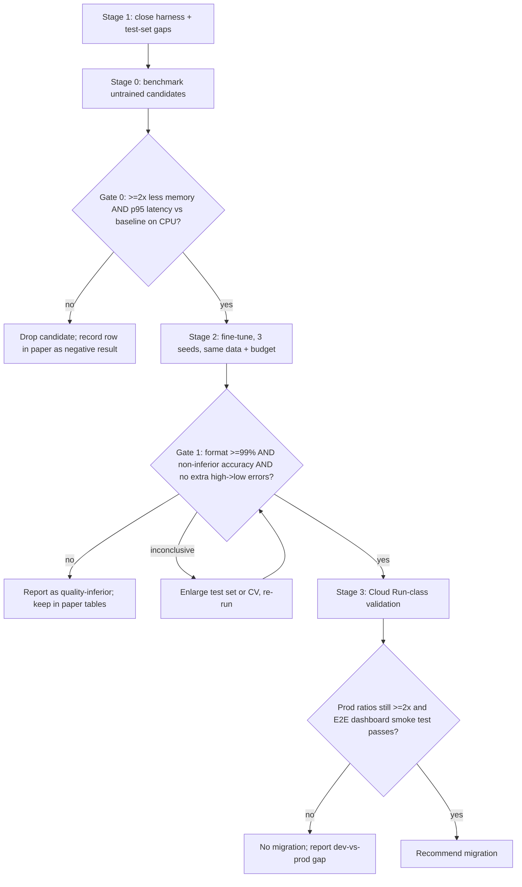

# Paper plan — comparing fine-tuned candidates for the Triage Classifier

**Status:** plan only — nothing in this document has been implemented or run. Thresholds in
"Pre-registered decision rules" must be committed *before* any Stage 2 result exists, so the commit
history proves they weren't tuned to the outcome.

**Research question.** For the hazard-report triage task (report + official context in →
`severity` + one-sentence `rationale` out), can a smaller fine-tuned model (BERT/BART family, or a
smaller decoder) match the current fine-tuned Phi-3.5-mini Q4_K_M on quality while using
substantially less memory and latency on the production-class CPU target?



Stage 1 is listed first because it is needed regardless of which candidate wins and Stage 0 only
needs the benchmark script skeleton (not the test set). They can overlap; the order shown is the
dependency order for *decisions*.

---

## 0. Investigation findings (what the repo has today)

### 0.1 Is there an eval harness? — **No. Gap.**

- No script, test, or notebook grades model outputs. The only quality signal ever used was
  **validation loss** printed by `mlx_lm.lora` (checkpoint "iter 100" picked from it — see
  `docs/FINETUNE_PLAN.md` Next steps item 6). Loss is not task accuracy and says nothing about
  format validity.
- `docs/BUILD_PLAN.md` step 4 ("validate each adapter against a small held-out set… even 10
  examples") and `docs/PITCH.md` ("build a labeled evaluation set for the classifier") both list
  evaluation as **future work**; neither was done.
- The existing parser is **unsuitable as a grader**: `classifier.parse_triage_output()` silently
  defaults a missing/invalid severity to `"medium"` and a missing rationale to
  `"No rationale produced."`. A model emitting garbage would "parse" and score as `medium` — this
  would hide exactly the failures the paper must measure. The harness needs a **strict** parser
  (reject, don't default) while still sharing the same format definition so the two can't drift.
- Serving uses `temperature=0.2` (`classifier.py`), so production outputs are not deterministic.
  The harness must use greedy decoding (temp 0, fixed seed) so reruns on the same weights give the
  same score; the serving setting is reported separately as a sensitivity check.

### 0.2 Is there a held-out test set with zero overlap? — **No. Gap.**

What exists: `backend/data/triage/{train,valid}.jsonl` (181 / 46 rows), generated from a 227-row
CSV by `scripts/generate_triage_dataset.py` (seeded shuffle, 80/20).

Verified by direct check on the committed files:

| Check | Result |
|---|---|
| Identical `report_text` in both train and valid | 0 |
| Identical full user message in both | 0 |
| Valid→train max token-Jaccard on report text | < 0.6 (no near-duplicates at that threshold) |

So train/valid are cleanly separated **as files**. That does not make `valid.jsonl` a test set:

1. **It was used for model selection.** Checkpoint choice was made on its loss → it is a
   validation set; reusing it for the headline number is optimistic by construction.
2. **The split is unstable.** The script reshuffles the *whole* CSV every run; any row
   added/edited moves rows between train and valid. A model selected on an old valid can have
   trained on rows now in valid. No row IDs, no persisted split.
3. **Not stratified.** `high` is 11/46 (24%) of valid vs 21/181 (12%) of train. Valid has only 11
   `high` rows → per-class numbers are extremely noisy.
4. **Too small.** n=46 → a 95% interval on accuracy is roughly ±12 points. Cannot resolve a
   few-point regression.
5. **Provenance mismatch.** The script reads `data/triage_examples.csv`; docs say the deployed
   weights were trained on `triage_examples_corrected.csv`. The committed JSONL's rationales match
   the *original* CSV 227/227 and the corrected CSV 226/227 (after whitespace stripping). Which
   data produced the deployed GGUF cannot be established from the repo. The paper needs one
   hash-pinned dataset.
6. **Single-source, fully synthetic.** All rows are authored by the same small team in one style;
   scores measure in-distribution performance on synthetic reports and must be framed that way
   (threat to validity, §7).

### 0.3 What does the consumption layer require? — format is strict where it matters

Producer: `classifier.py` → `main._triage()` → `Event.severity` / `Event.rationale` →
`GET /events` → dashboard (`frontend/src/routes/dashboard/+page.svelte`, `lib/severity.ts`,
`lib/Map.svelte`).

| Requirement | Source | Consequence of violation |
|---|---|---|
| Raw text is exactly two lines: `Severity: <low\|medium\|high>` then `Rationale: <one sentence>` | `SYSTEM_PROMPT`, training targets | Parser falls back to defaults (silent wrong data) |
| `severity` ∈ {`low`,`medium`,`high`}, **lowercase, exact** | `VALID_SEVERITIES`; `SEVERITY_COLORS` and `SEVERITY_RANK` are exact-key lookups | Unknown value → grey pin, excluded from filter counts, rank 0 in cluster "worst severity" |
| `rationale` non-empty, one sentence, shown as text + tooltip | dashboard `{#if selectedEvent.rationale}` | Empty → backend substitutes placeholder; multi-sentence/truncated text shown as-is |
| Output must finish within `max_tokens=80` | `classifier._stub_generate` | Truncated mid-sentence or missing `Rationale:` line |
| Input is the canonical render: `build_user_message(report, render_context_text(...))` + `SYSTEM_PROMPT` | `classifier.py`, `context.py` | Train/serve drift (project's stated top risk) |
| `hazard_type` is **never** model output | `main._triage` (deterministic) | n/a — candidates must not be asked to produce it |
| Call is synchronous inside an `async` handler | `main._triage` → `classifier.triage` | A slow model blocks the event loop → latency is a throughput issue, not just UX |

**Implication for non-generative candidates.** BERT/DistilBERT with a classification head can emit
`severity` but not a rationale. The dashboard tolerates a missing rationale (conditional render;
`Event.rationale` is `Optional`), but the backend currently substitutes "No rationale produced."
→ this is a **contract variant** needing an explicit owner decision (§8, D1). The paper reports
encoder candidates against the *severity-only* sub-contract and says so; only generative
candidates (BART, decoder) are scored on the full contract.

**What the harness must check (all mechanical, no LLM judge):**
1. *Format*: strict regex over the whole output — exactly two lines, in order, label spelling,
   severity in the enum, rationale non-empty, single sentence, ≤ N tokens, no trailing text, EOS
   reached before `max_tokens` (truncation = fail).
2. *Semantic*: predicted severity == gold severity.
3. *Safety-weighted*: confusion matrix; **under-triage** (gold `high` → predicted `low`/`medium`)
   reported separately, because a missed high is the costly error for emergency staff.
4. *Contract*: pushing the output through the real `parse_triage_output` and a pydantic `Event`
   yields the same `severity` the strict parser found (guards against the two parsers diverging).

Rationale *text quality* is not mechanically gradable. It is **not** part of the pass rate; report
only mechanical rationale properties (length, one sentence, non-empty, no copy of the severity
word contradicting the label) and, as a clearly labelled secondary result, optional
reference-based similarity (e.g. BERTScore) — never a gate.

---

## 1. The single benchmark script

`backend/eval/benchmark_model.py` — one entry point, identical for every candidate and the
baseline:

```bash
python -m eval.benchmark_model \
  --task triage \
  --model <path-or-hf-id> \
  --backend {llamacpp,mlx,hf,onnx} \
  --split {test,valid}  --n-runs 100 --threads 4 --device cpu \
  --out results/<run_id>.json --preds-out results/<run_id>.preds.jsonl
```

Design rules:

- **Task registry**: `--task triage` binds prompt builder, gold labels, strict grader, and output
  contract. Prompt assembly imports `classifier.SYSTEM_PROMPT` / `build_user_message` — never
  re-typed. The test set stores the *rendered* user message plus structured fields, and a test
  asserts rendered text == `render_context_text(...)` output.
- **Backend adapters** (small interface: `load()`, `generate(prompt) -> text, n_out_tokens`).
  Backend is a recorded variable, not hidden. Decoder LLMs: `llamacpp` (GGUF, serving path) and
  `mlx`. Encoder/BART: `hf` (PyTorch) and `onnx` (ONNX Runtime, int8) — see §3 for why GGUF may
  not cover them.
- **Process isolation**: the parent spawns a *fresh child process per model per phase* and samples
  child RSS with `psutil` (10 ms) — in-process `ru_maxrss` is avoided (kilobytes on Linux, bytes
  on macOS, and monotone across phases). Phases: (a) load → `peak_rss_load_mb`, `load_time_s`;
  (b) first request → `cold_first_request_s`; (c) warm-up 5 requests (discarded); (d) N timed
  requests → `peak_rss_infer_mb`, latency avg/p50/p95/p99, output tokens, tokens/s. On Apple
  Silicon also record MLX/Metal peak GPU-buffer memory (RSS under-counts unified memory; verify
  the exact API name for the installed `mlx` version).
- **Determinism**: greedy decoding, fixed seed, fixed `--threads`, fixed `max_new_tokens=80`
  (same as serving). A `--serving-sampling` flag reruns at `temperature=0.2` for the sensitivity
  check. Stage 1 verifies two runs on the same weights produce identical predictions; if not
  (thread-count float non-associativity), report the observed tolerance rather than assuming.
- **Primary device is CPU** (`n_gpu_layers=0` / `device=cpu`), because the production target is a
  CPU-only Cloud Run service (4 vCPU / 16 GiB, `cloudbuild.yaml`). Metal/MPS runs are secondary,
  dev-only rows.
- **Static compute proxies**: parameter count, on-disk size, quantisation scheme/bits, mean prompt
  tokens, mean generated tokens, and an estimated FLOPs/request (≈ 2 × params × tokens processed)
  — labelled an estimate. Latency is the primary compute measure.
- **Outputs**: one JSON row per (model, backend, device, split) plus a per-example predictions
  file. Environment fingerprint embedded in every row: git SHA, dataset SHA-256s, model file
  SHA-256, library versions, CPU model, OS, thread count, seed.

Row schema (sketch):

```json
{
  "run_id": "...", "task": "triage", "model": "phi35-q4km-baseline", "backend": "llamacpp",
  "device": "cpu", "threads": 4, "seed": 0, "decoding": "greedy",
  "env": {"git_sha": "...", "dataset_sha256": "...", "model_sha256": "...", "libs": {}, "cpu": "..."},
  "static": {"params_m": 0, "disk_mb": 0, "quant": "Q4_K_M", "mean_prompt_tokens": 0},
  "memory": {"peak_rss_load_mb": 0, "peak_rss_infer_mb": 0, "metal_peak_mb": null},
  "time": {"load_s": 0, "cold_first_s": 0, "n": 100,
           "avg_s": 0, "p50_s": 0, "p95_s": 0, "p99_s": 0, "tok_per_s": 0},
  "quality": {"n": 0, "format_pass": 0, "sev_acc": 0, "pass_rate": 0, "macro_f1": 0,
              "under_triage": 0, "by_meta_category": {}, "ci95": {"pass_rate": [0, 0]}},
  "contract": "full | severity_only"
}
```

`pass_rate` = strict format valid **and** severity == gold (one number comparable across
generative candidates). Encoder candidates report `sev_acc` and `contract: severity_only`.

`backend/eval/compare_rows.py` (small) consumes baseline + candidate rows and per-example preds →
diff table, paired bootstrap CI, McNemar test, gate verdicts. Comparing candidates is a diff of
rows, not eyeballing logs.

---

## 2. Candidates

| ID | Model | Params | Type | Contract coverage | Training path |
|---|---|---|---|---|---|
| **B0** | Phi-3.5-mini-instruct, LoRA, Q4_K_M GGUF (deployed) | ~3.8B | decoder | full | MLX → fuse → GGUF (existing) |
| **A** | `bart-base` (optionally `distilbart` variant) | ~140M | encoder-decoder | **full** (generates both lines) | HF Transformers (+PEFT LoRA) |
| **C** | `distilbert-base-uncased` | ~66M | encoder + class head | severity only | HF Transformers (+PEFT LoRA or full FT) |
| **C′** | `bert-base-uncased` | ~110M | encoder + class head | severity only | capacity ablation of C (Stage 0 + one run) |
| **D** (optional, conditional) | a ~1B decoder **whose architecture differs materially from Phi-3.5** (see below) | ~1B | decoder | full | **MLX LoRA → GGUF — identical pipeline to baseline** |

Recommendation: **finalists A and C** (answers the stated BART/BERT question; A is the only
small model covering the full contract). Add **D** only if it passes the architecture-difference
test below. Verify exact model IDs, licences and availability at the start of Stage 0.

**Candidate D inclusion rule.** D is included only if it is *architecturally* different from the
baseline, not merely smaller — otherwise the comparison reduces to "same architecture, fewer
parameters", which adds little. Phi-3.5-mini is a dense, decoder-only, Llama-style transformer
(multi-head attention, ~32k vocabulary, ~3.8B parameters). A ~1B Llama-3.2 model is *not*
significantly different in kind: it is the same dense decoder design, differing in size,
grouped-query attention, vocabulary (~128k) and tied embeddings. So Llama-3.2-1B alone does **not**
qualify as D.

D qualifies if it differs on at least one *structural* axis and still has both an `mlx_lm` LoRA
path and a llama.cpp/GGUF path (so the pipeline stays identical to the baseline's). Shortlist to
check against each model's `config.json` and the installed `mlx_lm` / `llama.cpp` support lists
(from memory, **not yet verified**):

| Option | Structural difference vs Phi-3.5 |
|---|---|
| Gemma-3-1B | interleaved local sliding-window / global attention, GQA, very large vocabulary |
| LFM2-1.2B-class | hybrid gated short-convolution + attention blocks (not a pure transformer) |
| A Mamba/SSM ~1B model | no attention — state-space recurrence (GGUF support must be confirmed) |
| Llama-3.2-1B / Qwen-class ~1B | fallback only: same dense design; usable as a *size-only* control, labelled as such |

If none passes the support check, drop D rather than substitute a same-architecture model under a
different name. Check licences before publishing derived weights (several of these carry custom
licences).

Baseline reference rows to run in addition to B0 (cheap, make the paper stronger):

- **Floor/ceiling controls**: majority class; copy `official_severity_hint` rule; keyword rule;
  TF-IDF + logistic regression on the same input. If a trivial classifier is within tolerance of
  B0, that is a central finding.
- **Quantisation ablation**: B0 as fused FP16/MLX vs Q4_K_M — separates quantisation loss from
  architecture.
- **Zero/few-shot base Phi-3.5** (no fine-tune) — shows what fine-tuning buys.

**Tooling caveats to verify in Stage 0 (not yet checked — I could not run any of this in the
planning environment: no `mlx_lm`, no `llama_cpp`, Linux):**

- `mlx_lm.lora` targets decoder LLMs; BERT/DistilBERT/BART are probably not supported for LoRA
  there → train A and C with HF Transformers + PEFT (MPS or CPU). Models this small can also be
  fully fine-tuned; if LoRA is a hard requirement, run LoRA as the primary and full FT as an
  ablation.
- `llama.cpp`'s GGUF support for BERT is oriented to embeddings, not classification heads, and
  BART may not be supported at all. If so, **GGUF + `llama-cpp-python` is not available for A/C**
  and they serve via ONNX Runtime int8 (or CTranslate2 for BART). Runtime then becomes a
  confound; report (i) each model on its best supported CPU runtime and (ii) any pair that
  shares a runtime. Do not claim an architecture effect that is really a runtime effect.

---

## 3. Stage 1 — close the harness and test-set gaps *(needed regardless)*

Deliverables, in order:

1. **Pin the training data.** Reconcile `triage_examples.csv` vs `_corrected.csv`; declare one
   canonical CSV; commit its SHA-256; fix the generator to read it. Re-derive and record which
   weights correspond to which data (retrain B0 if provenance can't be established).
2. **Stable, stratified split.** Add a `row_id` (hash of normalised report text); persist
   `splits.json` (train/valid assignment by row_id, stratified by `meta_category × severity`);
   generator reads it instead of reshuffling. New rows get assigned once and never move.
3. **Frozen test set.** `backend/data/triage_test/test.jsonl`:
   - **Newly authored rows, not carved from the existing 227** (no author-style overlap with
     train), stratified over the 5 `meta_category` values × 3 severities, with `high` deliberately
     over-represented (≥ 40 rows) so the safety-critical class is measurable.
   - **Size**: target 300–360, **floor 150**. (Paired-difference power: with ~15% of items on
     which two models disagree, a 95% CI half-width of ±4 points needs n ≈ z²·d/h² ≈ 360; n=150
     gives ≈ ±6 points. Below the floor, results are exploratory only.)
   - **Authoring (decided, D2)**: candidate rows are *machine-drafted, then human-verified or
     corrected*. To keep the test set independent and auditable:
     - Drafts come from a generator that is **not** one of the candidates being evaluated
       (avoids circularity), using a prompt that is committed to the repo; record generator,
       prompt version and date per row.
     - Every row carries `human_action` ∈ {accepted, edited, rejected} and an annotator ID
       (A1, A2 — IDs only, no personal details in the repo). Rejected rows are kept in an audit
       file, not silently dropped.
     - **Anchoring audit**: for at least a third of rows, the annotator assigns severity *before*
       seeing the drafted label; report agreement between blind label and draft, and Cohen's κ
       between two annotators on an overlapping subset. A high edit rate on `high` rows is a
       finding, not a failure.
     - Labels follow the documented severity-calibration rule; disagreements resolved and logged.
     - Drafted rows still pass the leakage tests below against train/valid.
   - **Frozen** by SHA-256 committed in the repo; never used for hyperparameter or checkpoint
     selection; touched once per final configuration (§5).
   - Same canonical render path (`context.render_context_text`, `classifier.build_user_message`).
4. **Leakage tests** (pytest, run in CI): no test `report_text` or full user message in
   train/valid; max token-Jaccard test→train below a threshold (start 0.6, same as measured
   today); split assignment unchanged when unrelated rows are appended.
5. **Strict grader + contract tests**: `backend/eval/grader.py` implementing §0.3's checks, unit
   tested on a table of good/bad outputs (extra lines, wrong case, `Severity: High`, missing
   rationale, two sentences, truncation); a test that the strict and lenient parsers agree on
   every well-formed output.
6. **Benchmark script + `compare_rows.py`** (§1), with a determinism test (same weights, two
   runs → identical predictions).
7. **Reproduce the baseline**: run B0 on the test set → first row. Report its pass rate and
   format-failure rate honestly; if it already fails format > 1% of the time at temp 0, that
   changes the interpretation of every comparison.

*Exit criterion:* baseline row exists, reruns identically, tests green.

---

## 4. Stage 0 — cheap resource screening *(runs on the benchmark skeleton from Stage 1 item 6)*

Quality is not measured here. Memory and latency depend on architecture, size, quantisation and
sequence length, not on trained weights, so untrained / randomly-initialised-head candidates are
a valid probe. Fine-tuning for a handful of steps is only needed where it changes behaviour that
affects latency (a generative model's output length) — in that case run ~20–50 LoRA steps so it
emits the two-line format and generates realistic token counts.

Procedure: run the benchmark on B0 and on each of A, C, C′, D with identical settings (CPU,
4 threads, N=100, real prompts from the validation split, `max_new_tokens=80`), 3 repeats of the
whole process for run-to-run variance.

**Decision gate 0 (pre-registered):** a candidate proceeds only if, on CPU, *both*
`peak_rss_infer_mb` and `p95` latency are **≤ 50% of B0's** (≥ 2× better), with the repeat-to-
repeat spread smaller than the margin by which it clears the gate. Fail → drop, keep the row in
the paper as a negative result.

Expected caveat to state in the paper: the encoder candidates will almost certainly clear a 2×
gate trivially (they are 30–60× smaller), so Gate 0 mainly screens the decoder (D) and BART (A)
and confirms the *magnitude* of the saving rather than discriminating. If a candidate passes Gate
0 it earns the right to be fine-tuned, nothing more; resource wins never override Gate 1.

---

## 5. Stage 2 — fine-tune and compare

**Training protocol (identical across candidates)**

- Same canonical train/valid split; inputs derived from the same rendered user message (decoder:
  chat messages; BART: source = system+user text, target = the two-line output; encoder: user
  message → severity label). A conversion function per model family, unit-tested against the
  canonical render.
- **Equal tuning budget**: same number of hyperparameter configurations per candidate (e.g. a
  small grid over learning rate × epochs/steps, ≤ 6 configs), same early-stopping rule, selected on
  **valid** (loss *and* strict-accuracy), never test.
- **3 training seeds per candidate** (including B0, retrained under the same protocol so its seed
  variance is measured; the originally deployed artifact is also reported as-is). Report mean ± sd
  across seeds. A single run per model is not publishable evidence.
- Record training cost too: wall-clock, peak training memory, trainable parameter count.
- Class imbalance handling (weights/oversampling) decided once, applied to all, stated.

**Evaluation protocol**

- The test set is evaluated **once per final (seed × candidate)**, after valid-based selection is
  frozen. No re-tuning after seeing test numbers; if the protocol must change, the old results
  stay in the paper's appendix.
- Metrics: strict format pass rate, severity accuracy, macro-F1, quadratic-weighted κ vs gold,
  under-triage count, per-`meta_category` breakdown, plus all Stage 0 resource metrics re-measured
  on the trained artifact.
- Statistics: Wilson interval for single proportions; **paired** bootstrap CI (10k resamples) and
  exact McNemar test for candidate vs B0 on the same items; seed variance reported alongside;
  Holm correction across candidates.
- Optional secondary: 5-fold CV over the pooled authored data (train+valid+test is *not* allowed
  to leak into model selection, so only a separate CV on train+valid) to tighten variance if the
  test set ends near the floor size.
- Robustness slice (small, mechanical): typo/paraphrase/long-report perturbations of test rows —
  reports degradation, not a gate.

**Pre-registered decision rules (Gate 1)** — all must hold for a candidate to be recommended:

| Criterion | Rule |
|---|---|
| Format validity (full-contract candidates) | strict format pass ≥ 99% on test at greedy decoding |
| Accuracy, non-inferiority | paired-bootstrap 95% CI lower bound of (candidate − B0) severity accuracy **> −5 points** |
| Safety | under-triage (gold `high` → not `high`) count **not higher than B0's** on the test set; any increase triggers manual review of those rows regardless of aggregate score |
| Resource | still ≥ 2× on memory and p95 latency after fine-tuning |

Three-way outcome, stated up front to handle small-n noise: **non-inferior** (CI lower bound >
−5), **inferior** (CI upper bound < 0 *and* point estimate ≤ −5), otherwise **inconclusive** →
enlarge the test set (or add CV) and re-run; do not call an inconclusive result a win or a loss.
The 5-point margin and the 2× gate are decided (D3, §8) and explained in §9; they are frozen
by commit before Stage 2 starts.

---

## 6. Stage 3 — production-representative validation

Dev-machine numbers (Apple Silicon, possibly Metal) are a *relative* signal. Before any
migration recommendation:

1. **Run the same benchmark script inside the production container image** on x86-64 Linux CPU
   (Cloud Build / a small GCE VM / a Cloud Run job — not an arm64 Mac running Docker under
   emulation, which would distort latency). Same vCPU count and memory limit as
   `cloudbuild.yaml` (4 vCPU / 16 GiB), and additionally the smaller footprint the candidate
   would permit (e.g. 2 vCPU / 4 GiB — the point of the exercise; note the baseline's history of
   OOM-kills at 4 GiB).
2. **Check the ratios, not the absolutes**: do the dev-machine candidate/B0 memory and latency
   ratios hold on the production target (≥ 2×)? Report the dev-vs-prod drift in the paper.
3. **Real cold start**: with `min-instances=0`, measure container start → first triaged event
   through the real HTTP path (`POST /events/community-report` → poll `GET /events`), baseline
   vs candidate. Also record Cloud Run's reported memory utilisation and billable time.
4. **End-to-end contract smoke test**: point the dashboard at the candidate-backed service
   (headless browser against a seeded report set) and assert severity pills, filter counts, map
   cluster colouring and rationale display behave identically to B0 — closes the loop on §0.3,
   including the severity-only variant if C is a finalist.
5. Only then write the migration recommendation (or the "do not migrate" conclusion).

---

## 7. Paper structure and validity

Outline: (1) motivation — small models for emergency-information triage; (2) task and output
contract; (3) dataset construction and the held-out protocol; (4) candidates and training
protocol; (5) benchmark methodology (memory/time/compute/quality, process isolation, determinism);
(6) results — resource table, quality table, Pareto plot (pass rate vs p95 latency vs peak RSS),
safety/under-triage analysis, dev-vs-prod validation; (7) threats to validity; (8) reproducibility
package.

Threats to validity to state plainly:

- Fully synthetic, small, single-team-authored data → in-distribution, may not transfer to real
  public reports; the test set mitigates author overlap but not synthetic-ness.
- Label subjectivity (severity); κ reported.
- Runtime/quantisation confounds across model families (§2 caveats).
- Test-set size limits resolvable effect sizes (§3 item 3).
- Hazard-planning data, not live emergency information: results say nothing about fitness for
  real emergency use; in an emergency, 111 (project ground rule).

Reproducibility package: pinned dependency lockfiles, container image digest, dataset hashes and
split file, benchmark script + raw rows + per-example predictions, seeds, hardware fingerprint,
and model-card/licence notes. Repo hygiene per `CLAUDE.md`: no participant names or contact
details in any artifact; no references to the OIA validation project; check licence terms of the
five official data sources before publishing anything derived from them; confirm base-model
licences before releasing fine-tuned weights.

---

## 8. Decisions

| # | Decision | Status |
|---|---|---|
| D1 | Severity-only candidates (no rationale) | **Decided: acceptable** — severity is the main output. Encoder candidates are scored on the severity-only contract; the paper states the contract delta. Still to settle in implementation: `rationale` = `null` vs. a deterministic template (default `null`; the dashboard already hides a missing rationale) |
| D2 | Test-set authoring | **Decided:** machine-drafted candidate rows, human-verified/corrected (protocol in §3 item 3) |
| D3 | Accuracy tolerance and resource gate | **Decided:** 5-point non-inferiority margin; 2× gate (explained in §9) |
| D4 | Candidate D (~1B decoder) | **Decided: optional, conditional** on being architecturally different from Phi-3.5 (§2) |
| D5 | Dev machine and Stage 3 x86 environment | Open — default: local Apple Silicon for dev; GCP x86 CPU for Stage 3 |

## 9. Todos

Rationale for the two frozen thresholds (include this reasoning in the paper's methods section):

- **5-point accuracy margin (non-inferiority).** We are not trying to prove the candidate is
  *better*; we are asking whether it is *not meaningfully worse* while being much cheaper. The
  margin is the largest accuracy loss we would accept in exchange for the resource saving. 5
  points is chosen because (a) the output is a triage aid that a staff member reviews, not an
  autonomous decision, so a small regression is tolerable; (b) the test set is small enough
  (~150–360 rows) that its sampling noise is already ±4–6 points, so a tighter margin could not be
  verified and would produce mostly "inconclusive" results; (c) severity labels are subjective,
  so differences below this are within plausible annotator disagreement. The rule uses the
  *lower bound of the paired 95% CI*, not the point estimate, so noise cannot rescue a candidate.
  It is paired with a separate safety rule (no extra gold-`high` → not-`high` errors) because
  average accuracy can hide a worse miss rate on the costly class.
- **2× resource gate.** A migration has fixed costs (a new training/serving path, ONNX or other
  runtime, re-validation, maintenance). A gain under ~2× would be inside the run-to-run and
  dev-vs-production measurement drift we expect and would not change which Cloud Run instance
  size is viable; ≥ 2× on *both* peak memory and p95 latency is a conservative threshold at which
  the saving is real, survives the Stage 3 environment change, and can plausibly justify a smaller
  instance. Both metrics must pass so a candidate cannot win on memory while being slower.

Checklist (tick as done):

**Stage 1 — gaps**
- [ ] Reconcile `triage_examples.csv` vs `_corrected.csv`; pin one canonical CSV by SHA-256; fix the generator
- [ ] Persist a stable, stratified split (`row_id`, `triage_splits.json`)
- [ ] Draft test-set rows with a non-candidate generator (committed prompt); record provenance per row
- [ ] Human verify/correct drafts; blind-label ≥ ⅓ for the anchoring audit; second annotator on an overlap subset; report κ
- [ ] Freeze the test set (SHA-256 committed); reach ≥ 150 rows, target 300–360, ≥ 40 `high`
- [ ] Leakage tests (exact, near-duplicate, split stability) in CI
- [ ] Strict grader + contract tests (strict vs. lenient parser agreement)
- [ ] `benchmark_model.py`, `compare_rows.py`, determinism test
- [ ] Reproduce the baseline row (and the quantisation, zero-shot and trivial-classifier controls)
- [ ] Commit `gates.yaml` with the 5-point margin and 2× gate **before** any Stage 2 run

**Stage 0 — screening**
- [ ] Verify tooling caveats (§2): BERT/BART support in `mlx_lm` LoRA and in llama.cpp GGUF; pick serving runtimes
- [ ] Benchmark B0, A, C, C′ (and D if it qualifies) on CPU, 3 repeats; apply the 2× gate

**Reduce confounding factors (per model family)**
- [ ] For each family, find its *best* fine-tuning recipe and its *best* serving architecture instead of reusing the baseline's settings, so differences reflect the models rather than a recipe tuned for Phi-3.5:
  - Fine-tuning: LoRA (rank, target layers, learning rate, steps) vs. full fine-tuning for the small encoders/BART; class-imbalance handling; max sequence length / truncation policy for the 512-token encoders.
  - Serving: for each family, compare runtimes and precisions (e.g. GGUF quant levels, ONNX Runtime fp32 vs. int8, CTranslate2 for BART, PyTorch as reference) and pick the best accuracy/resource trade-off *using valid, not test*.
- [ ] Give every family the same tuning *budget* (equal number of trials), with a family-specific search space; record every trial
- [ ] Report two comparisons: each family at its tuned best (what you would deploy) and all families under one controlled setting (same runtime where possible, same threads, same prompt length) — and state which differences are runtime-, precision- or architecture-driven
- [ ] Run the baseline through the same tuning protocol (LoRA settings, Q4_K_M vs. higher-precision quants) so it is not the only untuned model in the table

**Stage 2 / 3 / paper**
- [ ] Fine-tune A, C (and C′, D if included), 3 seeds each; single test-set pass per final config
- [ ] Gate 1 verdicts: non-inferior / inferior / inconclusive; Holm-corrected
- [ ] Stage 3 production-class validation and dashboard smoke test (both full and severity-only contracts)
- [ ] Decide D5 (machines); confirm model and data licences before releasing any weights
- [ ] Draft the paper (§7 outline) and the reproducibility package

## 10. Files this plan will add (none exist yet)

```
backend/eval/benchmark_model.py   backend/eval/grader.py     backend/eval/compare_rows.py
backend/eval/backends/            backend/eval/gates.yaml    backend/tests/test_eval_*.py
backend/data/triage_splits.json   backend/data/triage_test/test.jsonl   backend/data/triage_test.csv
backend/scripts/train_hf_candidate.py   results/  (rows + predictions, committed)
```
